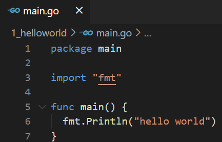
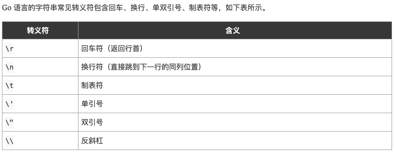

# Go

### 一、准备

笔记博客地址：https://www.liwenzhou.com/posts/Go/go_menu/


### 二、HelloWorld

1. 程序



2. 编译

   go build

   ​	在当前目录下： `go build` 

   ​	在其他目录下：`go build hello`

   ​								go编译器会去 `GOPATH`的`src`目录下查找你要编译的`hello`项目

   ​	我们还可以使用`-o`参数来指定编译后得到的可执行文件的名字。

   ​	`go build -o heiheihei.exe`

   

   go run

   ​	直接执行go文件

   


   go install

   ​	分为两步：

   ​			1.先编译得到一个可执行文件

   ​			2.将可执行文件拷贝到bin目录下

### 三、跨平台编译

默认我们`go build`的可执行文件都是当前操作系统可执行的文件，如果我想在windows下编译一个linux下可执行文件，那需要怎么做呢？

只需要指定目标操作系统的平台和处理器架构即可，例如Windows平台cmd下按如下方式指定环境变量。

```bash
SET CGO_ENABLED=0  // 禁用CGO
SET GOOS=linux  // 目标平台是linux
SET GOARCH=amd64  // 目标处理器架构是amd64
```

注意：如果你使用的是PowerShell终端，那么设置环境变量的语法为`$ENV:CGO_ENABLED=0`。

然后再执行`go build`命令，得到的就是能够在Linux平台运行的可执行文件了。

Mac 下编译 Linux 和 Windows平台 64位 可执行程序：

```bash
CGO_ENABLED=0 GOOS=linux GOARCH=amd64 go build
CGO_ENABLED=0 GOOS=windows GOARCH=amd64 go build
```

Linux 下编译 Mac 和 Windows 平台64位可执行程序：

```bash
CGO_ENABLED=0 GOOS=darwin GOARCH=amd64 go build
CGO_ENABLED=0 GOOS=windows GOARCH=amd64 go build
```

Windows下编译Mac平台64位可执行程序：

```bash
SET CGO_ENABLED=0
SET GOOS=darwin
SET GOARCH=amd64
go build
```


### 四、go module

`go module`是Go1.11版本之后官方推出的版本管理工具，并且从Go1.13版本开始，`go module`将是Go语言默认的依赖管理工具。

#### A. GO111MODULE

要启用`go module`支持首先要设置环境变量`GO111MODULE`，通过它可以开启或关闭模块支持，它有三个可选值：`off`、`on`、`auto`，默认值是`auto`。

1. `GO111MODULE=off`禁用模块支持，编译时会从`GOPATH`和`vendor`文件夹中查找包。
2. `GO111MODULE=on`启用模块支持，编译时会忽略`GOPATH`和`vendor`文件夹，只根据 `go.mod`下载依赖。
3. `GO111MODULE=auto`，当项目在`$GOPATH/src`外且项目根目录有`go.mod`文件时，开启模块支持。

简单来说，设置`GO111MODULE=on`之后就可以使用`go module`了，以后就没有必要在GOPATH中创建项目了，并且还能够很好的管理项目依赖的第三方包信息。

使用 go module 管理依赖后会在项目根目录下生成两个文件`go.mod`和`go.sum`。

#### B. GOPROXY

Go1.11之后设置GOPROXY命令为：

```bash
export GOPROXY=https://goproxy.cn
```

Go1.13之后`GOPROXY`默认值为`https://proxy.golang.org`，在国内是无法访问的，所以十分建议大家设置GOPROXY，这里我推荐使用[goproxy.cn](https://studygolang.com/topics/10014)。

```bash
go env -w GOPROXY=https://goproxy.cn,direct
```

#### C. go mod命令

常用的`go mod`命令如下：

```
go mod download    下载依赖的module到本地cache（默认为$GOPATH/pkg/mod目录）
go mod edit        编辑go.mod文件
go mod graph       打印模块依赖图
go mod init        初始化当前文件夹, 创建go.mod文件
go mod tidy        增加缺少的module，删除无用的module
go mod vendor      将依赖复制到vendor下
go mod verify      校验依赖
go mod why         解释为什么需要依赖
```

#### D. go.mod

go.mod文件记录了项目所有的依赖信息，其结构大致如下：

```sh
module github.com/Q1mi/studygo/blogger

go 1.12

require (
	github.com/DeanThompson/ginpprof v0.0.0-20190408063150-3be636683586
	github.com/gin-gonic/gin v1.4.0
	github.com/go-sql-driver/mysql v1.4.1
	github.com/jmoiron/sqlx v1.2.0
	github.com/satori/go.uuid v1.2.0
	google.golang.org/appengine v1.6.1 // indirect
)
```

其中，

- `module`用来定义包名
- `require`用来定义依赖包及版本
- `indirect`表示间接引用

##### 依赖的版本

go mod支持语义化版本号，比如`go get foo@v1.2.3`，也可以跟git的分支或tag，比如`go get foo@master`，当然也可以跟git提交哈希，比如`go get foo@e3702bed2`。关于依赖的版本支持以下几种格式：

```go
gopkg.in/tomb.v1 v1.0.0-20141024135613-dd632973f1e7
gopkg.in/vmihailenco/msgpack.v2 v2.9.1
gopkg.in/yaml.v2 <=v2.2.1
github.com/tatsushid/go-fastping v0.0.0-20160109021039-d7bb493dee3e
latest
```

##### replace

在国内访问`golang.org/x`的各个包都需要翻墙，你可以在`go.mod`中使用replace替换成`github`上对应的库。

```go
replace (
	golang.org/x/crypto v0.0.0-20180820150726-614d502a4dac => github.com/golang/crypto v0.0.0-20180820150726-614d502a4dac
	golang.org/x/net v0.0.0-20180821023952-922f4815f713 => github.com/golang/net v0.0.0-20180826012351-8a410e7b638d
	golang.org/x/text v0.3.0 => github.com/golang/text v0.3.0
)
```


#### E. go get

在项目中执行`go get`命令可以下载依赖包，并且还可以指定下载的版本。

1. 运行`go get -u`将会升级到最新的次要版本或者修订版本(x.y.z, z是修订版本号， y是次要版本号)
2. 运行`go get -u=patch`将会升级到最新的修订版本
3. 运行`go get package@version`将会升级到指定的版本号version

如果下载所有依赖可以使用`go mod download`命令。 

#### F. 整理依赖

我们在代码中删除依赖代码后，相关的依赖库并不会在`go.mod`文件中自动移除。这种情况下我们可以使用`go mod tidy`命令更新`go.mod`中的依赖关系。

#### G. go mod edit

##### 格式化

因为我们可以手动修改go.mod文件，所以有些时候需要格式化该文件。Go提供了一下命令：

```bash
go mod edit -fmt
```

##### 添加依赖项

```bash
go mod edit -require=golang.org/x/text
```

##### 移除依赖项

如果只是想修改`go.mod`文件中的内容，那么可以运行`go mod edit -droprequire=package path`，比如要在`go.mod`中移除`golang.org/x/text`包，可以使用如下命令：

```bash
go mod edit -droprequire=golang.org/x/text
```

关于`go mod edit`的更多用法可以通过`go help mod edit`查看。


#### H. 在项目中使用go module

##### 既有项目

如果需要对一个已经存在的项目启用`go module`，可以按照以下步骤操作：

1. 在项目目录下执行`go mod init`，生成一个`go.mod`文件。
2. 执行`go get`，查找并记录当前项目的依赖，同时生成一个`go.sum`记录每个依赖库的版本和哈希值。

##### 新项目

对于一个新创建的项目，我们可以在项目文件夹下按照以下步骤操作：

1. 执行`go mod init 项目名`命令，在当前项目文件夹下创建一个`go.mod`文件。
2. 手动编辑`go.mod`中的require依赖项或执行`go get`自动发现、维护依赖。

#### I. go module导入本地包

`go module`是Go1.11版本之后官方推出的版本管理工具，并且从`Go1.13`版本开始，`go module`将是Go语言默认的依赖管理工具。到今天`Go1.14`版本推出之后`Go modules` 功能已经被正式推荐在生产环境下使用了。

这几天已经有很多教程讲解如何使用`go module`，以及如何使用`go module`导入gitlab私有仓库，我这里就不再啰嗦了。但是最近我发现很多小伙伴在群里问如何使用`go module`导入本地包，作为初学者大家刚开始接触package的时候肯定都是先在本地创建一个包，然后本地调用一下，然后就被卡住了。。。

这里就详细介绍下如何使用`go module`导入本地包。

##### 前提

假设我们现在有`moduledemo`和`mypackage`两个包，其中`moduledemo`包中会导入`mypackage`包并使用它的`New`方法。

`mypackage/mypackage.go`内容如下：

```go
package mypackage

import "fmt"

func New(){
	fmt.Println("mypackage.New")
}
```

我们现在分两种情况讨论：

##### 在同一个项目下

**注意**：在一个项目（project）下我们是可以定义多个包（package）的。

目录结构

现在的情况是，我们在`moduledemo/main.go`中调用了`mypackage`这个包。

```bash
moduledemo
├── go.mod
├── main.go
└── mypackage
    └── mypackage.go
```

导入包

这个时候，我们需要在`moduledemo/go.mod`中按如下定义：

```go
module moduledemogo 1.14
```

然后在`moduledemo/main.go`中按如下方式导入`mypackage`

```go
package mainimport (	"fmt"	"moduledemo/mypackage"  // 导入同一项目下的mypackage包)func main() {	mypackage.New()	fmt.Println("main")}
```

举个例子

举一反三，假设我们现在有文件目录结构如下：

```bash
└── bubble    ├── dao    │   └── mysql.go    ├── go.mod    └── main.go
```

其中`bubble/go.mod`内容如下：

```go
module github.com/q1mi/bubblego 1.14
```

`bubble/dao/mysql.go`内容如下：

```go
package dao

import "fmt"

func New(){
	fmt.Println("mypackage.New")
}
```

`bubble/main.go`内容如下：

```go
package main

import (
	"fmt"
	"github.com/q1mi/bubble/dao"
)
func main() {
	dao.New()
	fmt.Println("main")
}
```

##### 不在同一个项目下

目录结构

```bash
├── moduledemo
│   ├── go.mod
│   └── main.go
└── mypackage
    ├── go.mod
    └── mypackage.go
```

导入包

这个时候，`mypackage`也需要进行module初始化，即拥有一个属于自己的`go.mod`文件，内容如下：

```go
module mypackagego 1.14
```

然后我们在`moduledemo/main.go`中按如下方式导入：

```go
import (	"fmt"	"mypackage")func main() {	mypackage.New()	fmt.Println("main")}
```

因为这两个包不在同一个项目路径下，你想要导入本地包，并且这些包也没有发布到远程的github或其他代码仓库地址。这个时候我们就需要在`go.mod`文件中使用`replace`指令。

在调用方也就是`moduledemo/go.mod`中按如下方式指定使用相对路径来寻找`mypackage`这个包。

```go
module moduledemogo 1.14require "mypackage" v0.0.0replace "mypackage" => "../mypackage"
```

举个例子

最后我们再举个例子巩固下上面的内容。

我们现在有文件目录结构如下：

```bash
├── p1│   ├── go.mod│   └── main.go└── p2    ├── go.mod    └── p2.go
```

`p1/main.go`中想要导入`p2.go`中定义的函数。

`p2/go.mod`内容如下：

```go
module liwenzhou.com/q1mi/p2go 1.14
```

`p1/main.go`中按如下方式导入

```go
import (	"fmt"	"liwenzhou.com/q1mi/p2")func main() {	p2.New()	fmt.Println("main")}
```

因为我并没有把`liwenzhou.com/q1mi/p2`这个包上传到`liwenzhou.com`这个网站，我们只是想导入本地的包，这个时候就需要用到`replace`这个指令了。

`p1/go.mod`内容如下：

```go
module github.com/q1mi/p1go 1.14require "liwenzhou.com/q1mi/p2" v0.0.0replace "liwenzhou.com/q1mi/p2" => "../p2"
```


###  五、变量

#### A. 声明

``` go
// var 变量名 变量类型
// e.g
var name string
var age int

// 批量声明
var (
	a string
  b int
  c bool
)
```

#### B.变量初始化

``` go
// var 变量名 类型 = 表达式
// e.g
var name string = 'Why'
var age int = 18
var name, age = 'Why', 20
```

有时候我们会将变量的类型省略，这个时候编译器会根据等号右边的值来推导变量的类型完成初始化。

```go
var name = "Q1mi"
var age = 18
```

#### C. 短变量声明

在函数内部，可以使用更简略的 `:=` 方式声明并初始化变量。

```go
package main

import (
	"fmt"
)
// 全局变量m
var m = 100

func main() {
	n := 10
	m := 200 // 此处声明局部变量m
	fmt.Println(m, n)
}
```

#### D. 匿名变量

在使用多重赋值时，如果想要忽略某个值，可以使用`匿名变量（anonymous variable）`。 匿名变量用一个下划线`_`表示，例如： 

```go
func foo() (int, string) {	return 10, "Q1mi"}func main() {	x, _ := foo()	_, y := foo()	fmt.Println("x=", x)	fmt.Println("y=", y)}
```

匿名变量不占用命名空间，不会分配内存，所以匿名变量之间不存在重复声明。 (在`Lua`等编程语言里，匿名变量也被叫做哑元变量。)

注意事项：

1. 函数外的每个语句都必须以关键字开始（var、const、func等）
2. `:=`不能使用在函数外。
3. `_`多用于占位，表示忽略值。

### 六、常量

相对于变量，常量是恒定不变的值，多用于定义程序运行期间不会改变的那些值。 常量的声明和变量声明非常类似，只是把`var`换成了`const`，常量在定义的时候必须赋值。

```go
const pi = 3.1415const e = 2.7182
```

声明了`pi`和`e`这两个常量之后，在整个程序运行期间它们的值都不能再发生变化了。

多个常量也可以一起声明：

```go
const (    pi = 3.1415    e = 2.7182)
```

const同时声明多个常量时，如果省略了值则表示和上面一行的值相同。 例如：

```go
const (    n1 = 100    n2    n3)
```

上面示例中，常量`n1`、`n2`、`n3`的值都是100。

#### A. iota

`iota`是go语言的常量计数器，只能在常量的表达式中使用。

`iota`在const关键字出现时将被重置为0。const中每新增一行常量声明将使`iota`计数一次(iota可理解为const语句块中的行索引)。 使用iota能简化定义，在定义枚举时很有用。

举个例子：

```go
const (		n1 = iota //0		n2        //1		n3        //2		n4        //3	)
```

#### 几个常见的`iota`示例:

使用`_`跳过某些值

```go
const (		n1 = iota //0		n2        //1		_		n4        //3	)
```

`iota`声明中间插队

```go
const (
		n1 = iota //0
		n2 = 100  //100
		n3 = iota //2
		n4        //3
	)
	const n5 = iota //0
```

多个`iota`定义在一行

```go
const (
		a, b = iota + 1, iota + 2 //1,2
		c, d                      //2,3
		e, f                      //3,4
	)
```


### 七、基本数据类型

#### A. 整型

整型分为以下两个大类： 按长度分为：`int8`、`int16`、`int32`、`int64` 对应的无符号整型：`uint8`、`uint16`、`uint32`、`uint64`

其中，`uint8`就是我们熟知的`byte`型，`int16`对应C语言中的`short`型，`int64`对应C语言中的`long`型。

#### B. 数字字面量

Go1.13版本之后引入了数字字面量语法，这样便于开发者以二进制、八进制或十六进制浮点数的格式定义数字，例如：
`v := 0b00101101`， 代表二进制的 101101，相当于十进制的 45。 `v := 0o377`，代表**八进制**的 377，相当于十进制的 255。 `v := 0x1p-2`，代表十六进制的 1 除以 2²，也就是 0.25。
而且还允许我们用 `_` 来分隔数字，比如说： `v := 123_456` 表示 v 的值等于 123456。
我们可以借助fmt函数来将一个整数以不同进制形式展示。 

```go
package main
 
import "fmt"
 
func main(){
	// 十进制
	var a int = 10
	fmt.Printf("%d \n", a)  // 10
	fmt.Printf("%b \n", a)  // 1010  占位符%b表示二进制
 
	// 八进制  以0开头
	var b int = 077
	fmt.Printf("%o \n", b)  // 77
 
	// 十六进制  以0x开头
	var c int = 0xff
	fmt.Printf("%x \n", c)  // ff
	fmt.Printf("%X \n", c)  // FF
}
```

#### C. 浮点型

Go语言支持两种浮点型数：`float32`和`float64`。这两种浮点型数据格式遵循`IEEE 754`标准： `float32` 的浮点数的最大范围约为 `3.4e38`，可以使用常量定义：`math.MaxFloat32`。 `float64` 的浮点数的最大范围约为 `1.8e308`，可以使用一个常量定义：`math.MaxFloat64`。

打印浮点数时，可以使用`fmt`包配合动词`%f`，代码如下：

```go
package mainimport (        "fmt"        "math")func main() {        fmt.Printf("%f\n", math.Pi)        fmt.Printf("%.2f\n", math.Pi)}
```

#### D. 复数

complex64和complex128

```go
var c1 complex64c1 = 1 + 2ivar c2 complex128c2 = 2 + 3ifmt.Println(c1)fmt.Println(c2)
```

复数有实部和虚部，complex64的实部和虚部为32位，complex128的实部和虚部为64位。

#### E. 布尔值

Go语言中以`bool`类型进行声明布尔型数据，布尔型数据只有`true（真）`和`false（假）`两个值。

**注意：**

1. 布尔类型变量的默认值为`false`。
2. Go 语言中不允许将整型强制转换为布尔型.
3. 布尔型无法参与数值运算，也无法与其他类型进行转换。

#### E. 字符串

Go语言中的字符串以原生数据类型出现，使用字符串就像使用其他原生数据类型（int、bool、float32、float64 等）一样。 Go 语言里的字符串的内部实现使用`UTF-8`编码。 字符串的值为`双引号(")`中的内容，可以在Go语言的源码中直接添加非ASCII码字符，例如：

```go
s1 := "hello"
s2 := "你好"
```



##### 多行字符串

Go语言中要定义一个多行字符串时，就必须使用`反引号`字符：

```go
s1 := `第一行
第二行
第三行
`
fmt.Println(s1)
```

##### 字符串常见操作

|                方法                 |      介绍      |
| :---------------------------------: | :------------: |
|              len(str)               |     求长度     |
|           +或fmt.Sprintf            |   拼接字符串   |
|            strings.Split            |      分割      |
|          strings.contains           |  判断是否包含  |
| strings.HasPrefix,strings.HasSuffix | 前缀/后缀判断  |
| strings.Index(),strings.LastIndex() | 子串出现的位置 |
| strings.Join(a[]string, sep string) |    join操作    |

##### byte 和 rune

组成每个字符串的元素叫做“字符”，可以通过遍历或者单个获取字符串元素获得字符。 字符用单引号（’）包裹起来，如：

```go
var a = '中'var b = 'x'
```

Go 语言的字符有以下两种：

1. `uint8`类型，或者叫 `byte` 型，代表了`ASCII码`的一个字符。
2. `rune`类型，代表一个 `UTF-8字符`。

当需要处理中文、日文或者其他复合字符时，则需要用到`rune`类型。`rune`类型实际是一个`int32`。

Go 使用了特殊的 rune 类型来处理 Unicode，让基于 Unicode 的文本处理更为方便，也可以使用 byte 型进行默认字符串处理，性能和扩展性都有照顾。

```go
// 遍历字符串
func traversalString() {
	s := "hello沙河"
	for i := 0; i < len(s); i++ { //byte
		fmt.Printf("%v(%c) ", s[i], s[i])
	}
	fmt.Println()
	for _, r := range s { //rune
		fmt.Printf("%v(%c) ", r, r)
	}
	fmt.Println()
}
```

输出：

```bash
104(h) 101(e) 108(l) 108(l) 111(o) 230(æ) 178(²) 153() 230(æ) 178(²) 179(³) 
104(h) 101(e) 108(l) 108(l) 111(o) 27801(沙) 27827(河) 
```

因为UTF8编码下一个中文汉字由3~4个字节组成，所以我们不能简单的按照字节去遍历一个包含中文的字符串，否则就会出现上面输出中第一行的结果。

字符串底层是一个byte数组，所以可以和`[]byte`类型相互转换。字符串是不能修改的 字符串是由byte字节组成，所以字符串的长度是byte字节的长度。 rune类型用来表示utf8字符，一个rune字符由一个或多个byte组成。

##### 修改字符串

要修改字符串，需要先将其转换成`[]rune`或`[]byte`，完成后再转换为`string`。无论哪种转换，都会重新分配内存，并复制字节数组。

```go
func changeString() {
	s1 := "big"
	// 强制类型转换
	byteS1 := []byte(s1)
	byteS1[0] = 'p'
	fmt.Println(string(byteS1))

	s2 := "白萝卜"
	runeS2 := []rune(s2)
	runeS2[0] = '红'
	fmt.Println(string(runeS2))
}
```

#### F.强制类型转换

Go语言中只有强制类型转换，没有隐式类型转换。该语法只能在两个类型之间支持相互转换的时候使用。

强制类型转换的基本语法如下：

```bash
T(表达式)
```

其中，T表示要转换的类型。表达式包括变量、复杂算子和函数返回值等.

比如计算直角三角形的斜边长时使用math包的Sqrt()函数，该函数接收的是float64类型的参数，而变量a和b都是int类型的，这个时候就需要将a和b强制类型转换为float64类型。

```go
func sqrtDemo() {
	var a, b = 3, 4
	var c int
	// math.Sqrt()接收的参数是float64类型，需要强制转换
	c = int(math.Sqrt(float64(a*a + b*b)))
	fmt.Println(c)
}
```

 

### 八、运算符

### 九、流程控制

#### A. if

Go语言中`if`条件判断的格式如下：

```go
if 表达式1 {
    分支1
} else if 表达式2 {
    分支2
} else{
    分支3
}
```

Go语言规定与`if`匹配的左括号`{`必须与`if和表达式`放在同一行，`{`放在其他位置会触发编译错误。 同理，与`else`匹配的`{`也必须与`else`写在同一行，`else`也必须与上一个`if`或`else if`右边的大括号在同一行。

##### if条件判断特殊写法

if条件判断还有一种特殊的写法，可以在 if 表达式之前添加一个执行语句，再根据变量值进行判断，举个例子：

```go
func ifDemo2() {
	if score := 65; score >= 90 {
		fmt.Println("A")
	} else if score > 75 {
		fmt.Println("B")
	} else {
		fmt.Println("C")
	}
}
```

#### B. switch

使用`switch`语句可方便地对大量的值进行条件判断。

```go
func switchDemo1() {
	finger := 3
	switch finger {
	case 1:
		fmt.Println("大拇指")
	case 2:
		fmt.Println("食指")
	case 3:
		fmt.Println("中指")
	case 4:
		fmt.Println("无名指")
	case 5:
		fmt.Println("小拇指")
	default:
		fmt.Println("无效的输入！")
	}
}
```

Go语言规定每个`switch`只能有一个`default`分支。

一个分支可以有多个值，多个case值中间使用英文逗号分隔。

```go
func testSwitch3() {
	switch n := 7; n {
	case 1, 3, 5, 7, 9:
		fmt.Println("奇数")
	case 2, 4, 6, 8:
		fmt.Println("偶数")
	default:
		fmt.Println(n)
	}
}
```

分支还可以使用表达式，这时候switch语句后面不需要再跟判断变量。例如：

```go
func switchDemo4() {
	age := 30
	switch {
	case age < 25:
		fmt.Println("好好学习吧")
	case age > 25 && age < 35:
		fmt.Println("好好工作吧")
	case age > 60:
		fmt.Println("好好享受吧")
	default:
		fmt.Println("活着真好")
	}
}
```

##### fallthrough

`fallthrough`语法可以执行满足条件的case的下一个case，是为了兼容C语言中的case设计的。

```go
func switchDemo5() {
	s := "a"
	switch {
	case s == "a":
		fmt.Println("a")
		fallthrough
	case s == "b":
		fmt.Println("b")
	case s == "c":
		fmt.Println("c")
	default:
		fmt.Println("...")
	}
}
```

输出：

```bash
a
b
```


#### C. for

Go 语言中的所有循环类型均可以使用`for`关键字来完成。

for循环的基本格式如下：

```bash
for 初始语句;条件表达式;结束语句{
    循环体语句
}
```

条件表达式返回`true`时循环体不停地进行循环，直到条件表达式返回`false`时自动退出循环。

```go
func forDemo() {
	for i := 0; i < 10; i++ {
		fmt.Println(i)
	}
}
```

for循环的初始语句可以被忽略，但是初始语句后的分号必须要写，例如：

```go
func forDemo2() {
	i := 0
	for ; i < 10; i++ {
		fmt.Println(i)
	}
}
```

for循环的初始语句和结束语句都可以省略，例如：

```go
func forDemo3() {
	i := 0
	for i < 10 {
		fmt.Println(i)
		i++
	}
}
```

这种写法类似于其他编程语言中的`while`，在`while`后添加一个条件表达式，满足条件表达式时持续循环，否则结束循环。

##### 无限循环

```go
for {
    循环体语句
}
```

for循环可以通过`break`、`goto`、`return`、`panic`语句强制退出循环。

##### for range(键值循环)

Go语言中可以使用`for range`遍历数组、切片、字符串、map 及通道（channel）。 通过`for range`遍历的返回值有以下规律：

1. 数组、切片、字符串返回`索引和值`。
2. map返回键和值。
3. 通道（channel）只返回通道内的值。

#### D. goto

goto(跳转到指定标签)

`goto`语句通过标签进行代码间的无条件跳转。`goto`语句可以在快速跳出循环、避免重复退出上有一定的帮助。Go语言中使用`goto`语句能简化一些代码的实现过程。 例如双层嵌套的for循环要退出时：

```go
func gotoDemo1() {
	var breakFlag bool
	for i := 0; i < 10; i++ {
		for j := 0; j < 10; j++ {
			if j == 2 {
				// 设置退出标签
				breakFlag = true
				break
			}
			fmt.Printf("%v-%v\n", i, j)
		}
		// 外层for循环判断
		if breakFlag {
			break
		}
	}
}
```

使用`goto`语句能简化代码：

```go
func gotoDemo2() {
	for i := 0; i < 10; i++ {
		for j := 0; j < 10; j++ {
			if j == 2 {
				// 设置退出标签
				goto breakTag
			}
			fmt.Printf("%v-%v\n", i, j)
		}
	}
	return
	// 标签
breakTag:
	fmt.Println("结束for循环")
}
```

#### E. break

`break`语句可以结束`for`、`switch`和`select`的代码块。

`break`语句还可以在语句后面添加标签，表示退出某个标签对应的代码块，标签要求必须定义在对应的`for`、`switch`和 `select`的代码块上。 举个例子：

```go
func breakDemo1() {
BREAKDEMO1:
	for i := 0; i < 10; i++ {
		for j := 0; j < 10; j++ {
			if j == 2 {
				break BREAKDEMO1
			}
			fmt.Printf("%v-%v\n", i, j)
		}
	}
	fmt.Println("...")
}
```

F. continue

`continue`语句可以结束当前循环，开始下一次的循环迭代过程，仅限在`for`循环内使用。

在 `continue`语句后添加标签时，表示开始标签对应的循环。例如：

```go
func continueDemo() {
forloop1:
	for i := 0; i < 5; i++ {
		// forloop2:
		for j := 0; j < 5; j++ {
			if i == 2 && j == 2 {
				continue forloop1
			}
			fmt.Printf("%v-%v\n", i, j)
		}
	}
}
```

### 十、数组

Array(数组)

数组是同一种数据类型元素的集合。 在Go语言中，数组从声明时就确定，使用时可以修改数组成员，但是数组大小不可变化。 基本语法：

A. 数组定义：

```go
// 定义一个长度为3元素类型为int的数组a
var a [3]int
```

比如：`var a [5]int`， 数组的长度必须是常量，并且长度是数组类型的一部分。一旦定义，长度不能变。 `[5]int`和`[10]int`是不同的类型。

```go
var a [3]int
var b [4]int
a = b //不可以这样做，因为此时a和b是不同的类型
```

数组可以通过下标进行访问，下标是从`0`开始，最后一个元素下标是：`len-1`，访问越界（下标在合法范围之外），则触发访问越界，会panic。

#### B. 数组的初始化

数组的初始化也有很多方式。

##### 方法一

初始化数组时可以使用初始化列表来设置数组元素的值。

```go
func main() {
	var testArray [3]int                        //数组会初始化为int类型的零值
	var numArray = [3]int{1, 2}                 //使用指定的初始值完成初始化
	var cityArray = [3]string{"北京", "上海", "深圳"} //使用指定的初始值完成初始化
	fmt.Println(testArray)                      //[0 0 0]
	fmt.Println(numArray)                       //[1 2 0]
	fmt.Println(cityArray)                      //[北京 上海 深圳]
}
```

##### 方法二

按照上面的方法每次都要确保提供的初始值和数组长度一致，一般情况下我们可以让编译器根据初始值的个数自行推断数组的长度，例如：

```go
func main() {
	var testArray [3]int
	var numArray = [...]int{1, 2}
	var cityArray = [...]string{"北京", "上海", "深圳"}
	fmt.Println(testArray)                          //[0 0 0]
	fmt.Println(numArray)                           //[1 2]
	fmt.Printf("type of numArray:%T\n", numArray)   //type of numArray:[2]int
	fmt.Println(cityArray)                          //[北京 上海 深圳]
	fmt.Printf("type of cityArray:%T\n", cityArray) //type of cityArray:[3]string
}
```

##### 方法三

我们还可以使用指定索引值的方式来初始化数组，例如:

```go
func main() {
	a := [...]int{1: 1, 3: 5}
	fmt.Println(a)                  // [0 1 0 5]
	fmt.Printf("type of a:%T\n", a) //type of a:[4]int
}
```

#### C. 数组的遍历

遍历数组a有以下两种方法：

```go
func main() {
	var a = [...]string{"北京", "上海", "深圳"}
	// 方法1：for循环遍历
	for i := 0; i < len(a); i++ {
		fmt.Println(a[i])
	}

	// 方法2：for range遍历
	for index, value := range a {
		fmt.Println(index, value)
	}
}
```

#### D. 多维数组

Go语言是支持多维数组的，我们这里以二维数组为例（数组中又嵌套数组）。

##### 二维数组的定义

```go
func main() {
	a := [3][2]string{
		{"北京", "上海"},
		{"广州", "深圳"},
		{"成都", "重庆"},
	}
	fmt.Println(a) //[[北京 上海] [广州 深圳] [成都 重庆]]
	fmt.Println(a[2][1]) //支持索引取值:重庆
}
```

##### 二维数组的遍历

```go
func main() {
	a := [3][2]string{
		{"北京", "上海"},
		{"广州", "深圳"},
		{"成都", "重庆"},
	}
	for _, v1 := range a {
		for _, v2 := range v1 {
			fmt.Printf("%s\t", v2)
		}
		fmt.Println()
	}
}
```

输出：

```bash
北京	上海	
广州	深圳	
成都	重庆	
```

**注意：** 多维数组**只有第一层**可以使用`...`来让编译器推导数组长度。例如：

```go
//支持的写法
a := [...][2]string{
	{"北京", "上海"},
	{"广州", "深圳"},
	{"成都", "重庆"},
}
//不支持多维数组的内层使用...
b := [3][...]string{
	{"北京", "上海"},
	{"广州", "深圳"},
	{"成都", "重庆"},
}
```

#### E. 数组是值类型

数组是值类型，赋值和传参会复制整个数组。因此改变副本的值，不会改变本身的值。

```go
func modifyArray(x [3]int) {
	x[0] = 100
}

func modifyArray2(x [3][2]int) {
	x[2][0] = 100
}
func main() {
	a := [3]int{10, 20, 30}
	modifyArray(a) //在modify中修改的是a的副本x
	fmt.Println(a) //[10 20 30]
	b := [3][2]int{
		{1, 1},
		{1, 1},
		{1, 1},
	}
	modifyArray2(b) //在modify中修改的是b的副本x
	fmt.Println(b)  //[[1 1] [1 1] [1 1]]
}
```

**注意：**

1. 数组支持 “==“、”!=” 操作符，因为内存总是被初始化过的。
2. `[n]*T`表示指针数组，`*[n]T`表示数组指针 。